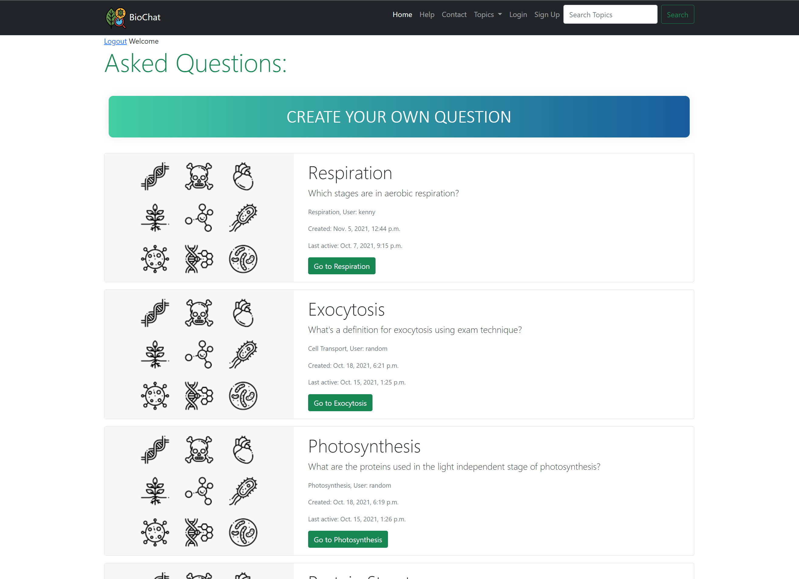

# Django Forum

This project is a web application built with Django, a high-level Python web framework, aimed at providing a platform
for discussions and interactions involving Biology among users.



## Features

- User authentication: Users can sign up, log in, and manage their accounts.
- Forum categories: Organise discussions into different categories for easy navigation.
- Thread creation: Users can create new discussion threads within categories.
- Commenting: Users can comment on threads to engage in discussions.
- Moderation: Administrators can manage users, threads, and comments.

## Installation

To run Django Forum locally, follow these steps:

1. Clone the repository:

   ```git clone https://github.com/incogkenny/Django-Forum.git```
2. Navigate to the Project Directory

   ```cd Django-Forum```
3. Create virtual environment for project using IDE
4. Install the dependencies:

   ```pip install -r requirements.txt```
5. Apply Migrations when in second src folder:

   ```
   cd src
   python manage.py migrate
   ```
6. Create a superuser (admin account):

   ```python manage.py createsuperuser```
7. Start the development server:

   ```python manage.py runserver```
8. Access the application in your web browser at `http://localhost:8000`.

## Usage

- Register an account or log in if you already have one.
- Explore the existing forum categories or create your own.
- Start new discussion threads or participate in existing ones by commenting.
- Administrators can manage users, threads, and comments through the admin interface.

## Documentation
[Here's a link to the documentation](Forum%20Documentation.pdf)